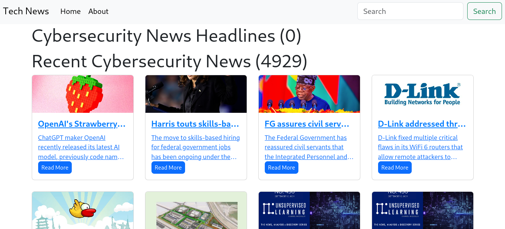
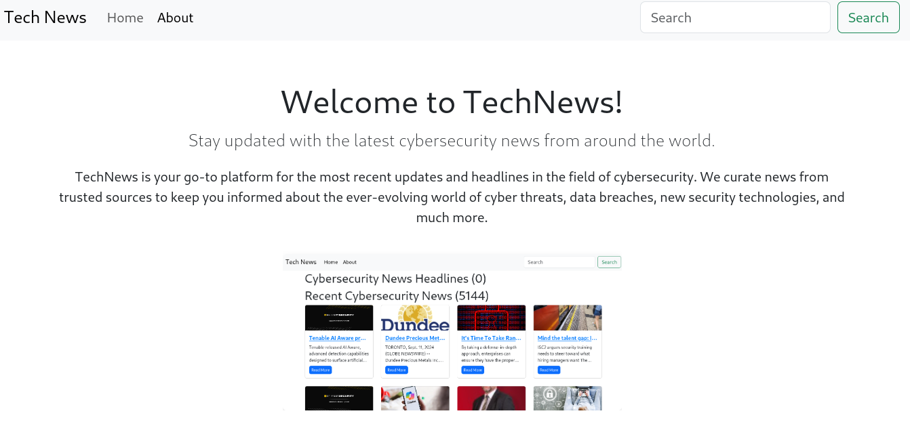

# TechNews

Welcome to TechNews, the web application designed for anyone who’s passionate about cybersecurity and wants to stay ahead of the latest trends. I’m Emmanuel Koech, the developer behind this project. Let me take you through the story of TechNews and why I built it.

**Author**: Emmanuel Koech  
**LinkedIn**: [Emmanuel Koech](https://www.linkedin.com/in/emmanuel-koech/)  
**Deployed Site**: [TechNews Live](https://emmanuelk0ech.pythonanywhere.com/)

## The Inspiration

As someone deeply interested in cybersecurity, keeping up with the latest news and trends is crucial. The rapidly evolving field demands that we stay informed about new threats, innovations, and best practices. This need for constant updates inspired me to create TechNews—a simple yet powerful tool to fetch and display the latest cybersecurity news articles from around the globe.

## The Challenge

In developing TechNews, I faced several challenges. Integrating with the News API to fetch and display news articles dynamically required a solid understanding of JavaScript and asynchronous programming. Ensuring the application remained responsive and user-friendly while handling large volumes of data added another layer of complexity. I spent countless hours fine-tuning the pagination and optimizing the API requests to enhance performance.

## A Humorous Twist

Here’s a fun scenario I like to imagine: Picture someone going for a cybersecurity role interview, armed with TechNews on their phone. They quickly check the latest headlines right before the interview, dropping impressive references to recent news. As they walk out, they get the job offer! Whether or not that’s entirely realistic, it highlights how keeping up with the latest news can give you an edge.

## Project Features

- **Responsive Design**: Built with Bootstrap to ensure a clean and adaptable UI on all devices.
- **Search Functionality**: Users can search for the latest news articles by keywords.
- **Pagination**: Efficiently navigate through multiple pages of articles.
- **Dynamic Content Loading**: Fetch and display articles in real-time with JavaScript.
- **Article Cards**: View articles in a neatly formatted card layout with titles, images, and descriptions.
- **External Links**: Easy access to the full articles on their original news sites.

## Demo

Here’s a peek at TechNews in action:

### Landing Page


### Home Page


### About Page


## Installation

Getting started with TechNews is easy:

1. **Clone the repository**:
    ```bash
    git clone https://github.com/Emmanuel-K0ech/Tech_News.git
    cd technews
    ```

2. **Open the application**:
   Simply open the `home.html` file in your web browser.

3. **Set Up API Key**:
   - Replace `YOUR_API_KEY_HERE` in the JavaScript code with your News API key.

## Usage

1. **Search for News Articles**: Enter a keyword in the search bar and hit "Search" to fetch relevant news.
2. **Navigate Between Pages**: Use the "Previous Page" and "Next Page" buttons to browse through the articles.

## Technologies Used

- **HTML5**: Structuring the web page.
- **CSS3**: Styling with Bootstrap 5.
- **JavaScript (ES6+)**: Handling dynamic content and API integration.
- **Bootstrap 5**: Ensuring a responsive and user-friendly design.
- **News API**: Providing access to a wide range of news sources.

## API Reference

TechNews leverages the [News API](https://newsapi.org/) to pull in the latest articles:

- **Endpoint**: `https://newsapi.org/v2/everything`
- **Parameters**:
  - `q` (required): Keywords to search for.
  - `from` (optional): Start date for the articles.
  - `language` (optional): Language of the articles.
  - `pageSize` (optional): Number of articles per page.
  - `page` (optional): Page number to retrieve.
  - `sortBy` (optional): Sorting criteria (e.g., `popularity`).

## Contributing

I welcome contributions to TechNews! To get involved:

1. Fork the repository.
2. Create a new branch (`git checkout -b feature/YourFeature`).
3. Commit your changes (`git commit -am 'Add a new feature'`).
4. Push to your branch (`git push origin feature/YourFeature`).
5. Open a Pull Request.

## License

This project is licensed under the MIT License. See the [LICENSE](LICENSE) file for details.
